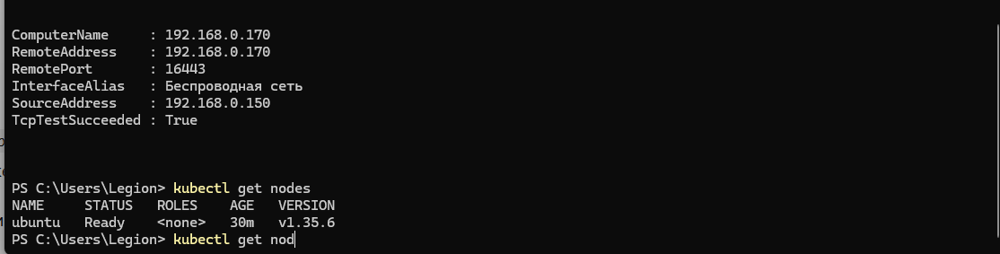
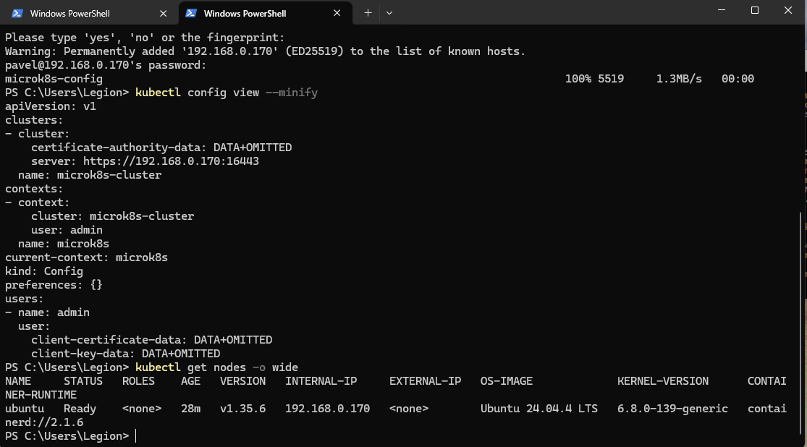
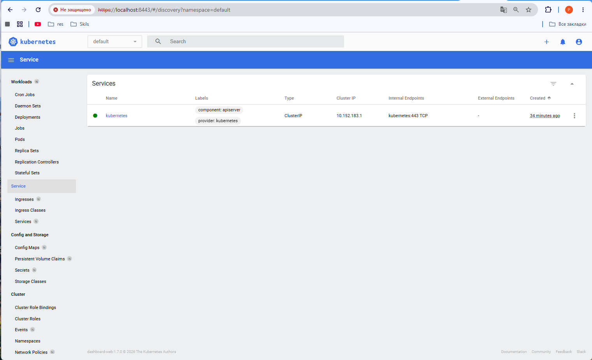

# Домашнее задание к занятию «Kubernetes. Причины появления. Команда kubectl»

## Задание 1. Установка MicroK8S

Для выполнения задания была подготовлена виртуальная машина с **Ubuntu 24.04.4 LTS**.

На виртуальную машину установлен MicroK8S:

```bash
sudo apt update
sudo apt install -y snapd
sudo snap install microk8s --classic --channel=1.35
```

Текущий пользователь был добавлен в группу `microk8s`:

```bash
sudo usermod -a -G microk8s $USER
```

После установки проверен статус MicroK8S:

```bash
microk8s status --wait-ready
```

Также проверено состояние ноды:

```bash
microk8s kubectl get nodes -o wide
```

Нода `ubuntu` находится в состоянии `Ready`.

### Установка Kubernetes Dashboard

Dashboard был включён командой:

```bash
microk8s enable dashboard
```

Состояние компонентов Dashboard проверено командами:

```bash
microk8s kubectl get pods -A | grep dashboard
microk8s kubectl get svc -A | grep dashboard
```

Все компоненты Dashboard находятся в состоянии `Running`.

### Настройка сертификата для подключения по IP

IP-адрес виртуальной машины:

```text
192.168.0.170
```

В файл:

```text
/var/snap/microk8s/current/certs/csr.conf.template
```

был добавлен IP-адрес:

```text
IP.3 = 192.168.0.170
```

После этого сертификат API Server был обновлён:

```bash
sudo microk8s refresh-certs -e server.crt
```

Проверка сертификата:

```bash
sudo openssl x509 \
  -in /var/snap/microk8s/current/certs/server.crt \
  -noout -text | grep -A2 "Subject Alternative Name"
```

В `Subject Alternative Name` присутствует IP-адрес виртуальной машины:

```text
IP Address:192.168.0.170
```

---

## Задание 2. Установка и настройка локального kubectl

На локальную машину с Windows установлен `kubectl`.

Конфигурация MicroK8S была получена на виртуальной машине командой:

```bash
microk8s config > ~/microk8s-config
```

В kubeconfig настроен адрес Kubernetes API Server:

```text
https://192.168.0.170:16443
```

Конфигурация была скопирована на локальный компьютер в файл:

```text
C:\Users\Legion\.kube\config
```

Подключение к Kubernetes API Server проверено с локального компьютера:

```powershell
Test-NetConnection 192.168.0.170 -Port 16443
```

Результат проверки:

```text
TcpTestSucceeded : True
```

### Проверка подключения kubectl к кластеру

На локальном компьютере выполнена команда:

```powershell
kubectl get nodes
```

Результат:



Дополнительно состояние ноды было проверено расширенной командой:

```powershell
kubectl get nodes -o wide
```



Нода `ubuntu` доступна с локального компьютера и находится в состоянии `Ready`.

### Подключение к Kubernetes Dashboard

Для доступа к Dashboard с локального компьютера выполнен проброс порта:

```powershell
kubectl -n kubernetes-dashboard port-forward svc/kubernetes-dashboard-kong-proxy 8443:443
```

После этого Dashboard доступен в браузере по адресу:

```text
https://localhost:8443
```

Результат:



---

## Итог

В результате выполнения работы:

- установлен и настроен MicroK8S;
- установлено дополнение Kubernetes Dashboard;
- настроен сертификат для подключения к API Server по IP `192.168.0.170`;
- установлен и настроен локальный `kubectl`;
- настроено подключение `kubectl` к кластеру MicroK8S;
- выполнено подключение к Kubernetes Dashboard через `port-forward`.
